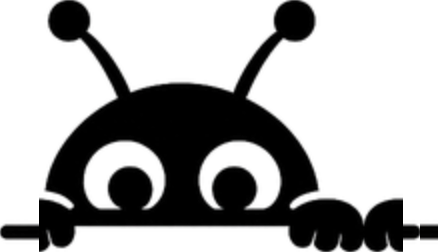

<p align="center">
  <picture>
    <source media="(prefers-color-scheme: dark)" srcset="assets/kaval-logo-white.svg">
    
  </picture>
</p>

# Kaval

**A pre-merge gate that catches silent regressions — the behavior changes that pass review and pass CI, then page someone at 2am.**

A reviewer reads the diff. CI runs the new code against tests someone already thought to write. Both miss the same thing: a change that quietly does something different on an input nobody has a test for. The status check is green. The PR merges. The regression ships.

Kaval runs **both** versions of every change — the code before your diff and the code after — on the same inputs, and shows you exactly where the behavior diverged. Not "this line looks risky." The actual before and after, executed.

```
⚠ CHANGED   subscription with no status
   before  "default_incomplete"
   after   "allow_incomplete"
```

Reading the diff, you'd never know. Running it, you can't miss it.

→ **Run it on any public repo, no install: [usekaval.com](https://usekaval.com)**

---

## See the idea in 30 seconds (offline, zero deps)

Clone this repo and run the reference replay. It runs both versions of one function on the same inputs and diffs the result — the whole idea, in ~50 lines:

```bash
node examples/replay.mjs
```

Then render a real-shaped report from the open format:

```bash
node bin/render.mjs examples/report.sample.json
```

Both need nothing but Node 18+. No token, no network, no account.

---

## They run the new code. We run both.

Every other tool that touches your PR is looking at one version of the world:

- **CI / tests** run the *new* code against cases someone already wrote. A regression on an un-tested input sails through green.
- **Linters / type checkers** read the *new* code's shape. A behavior change with a valid type is invisible to them.
- **AI review** reads the *diff* and guesses. Plausible, fast, and unproven — it can't tell you what the code actually *does* differently because it never ran it.

They catch loud bugs — the new code throwing, the type not matching. Kaval is built for the **silent** ones: the change that runs fine, returns a different answer, and waits.

The way you catch a silent regression is to run both versions and compare. That's the entire premise.

---

## On every PR

Install the GitHub App and Kaval posts an **advisory** check on each pull request: what behavior changed, with executed before/after evidence, and a verdict. It blocks nothing — it tells you what review and CI couldn't, and a human decides.

→ **[Install the GitHub App](https://usekaval.com)**

We don't claim to catch everything. A report shows its denominator and lists its misses on purpose (see `examples/report.sample.json`) — a tool that only printed its hits wouldn't be worth trusting. The goal is **confidence on what it does flag**, not a completeness badge.

---

## What's open, and what's hosted

We'd rather be straight about this than imply more is open than is.

**Open (this repo, MIT):**
- `SPEC.md` — the `kaval:1` report format. Render it, store it, diff it, build on it with no tool of ours.
- `bin/render.mjs` — a zero-dependency reference renderer for that format.
- `examples/replay.mjs` — a toy of the core move: run both versions, diff the behavior.
- `bin/kaval.mjs` — the thin client that drives the hosted engine.

**Hosted (our servers):**
- The engine. It sandboxes untrusted code with no network, mocks your dependencies, generates edge-case inputs from your schemas, executes JavaScript/TypeScript and Python, and classifies every behavior flip into a verdict against the change's stated intent.

The hard, dangerous part of this is safely executing arbitrary code from arbitrary repos. That runs on infrastructure we operate, not as a library you `npm install` and point at your laptop. The format and the client are open so the report is yours and never locked in; the engine is a service. We think that's the honest shape for this, and we're saying so up front rather than letting "open source" do more work than it should.

---

## The thin client

For CI or scripting, drive the hosted engine from the command line:

```bash
KAVAL_TOKEN=... npx @usekaval/kaval dubinc/dub
```

Running a repo requires a free GitHub sign-in (that's the quota boundary). Grab a token at [usekaval.com](https://usekaval.com). Viewing a finished report needs nothing — reports live at a URL.

---

## The report format

`kaval:1` is a small, stable JSON document: a scoreboard (analyzed / flagged / missed, plus a control set and its false-block count) and a list of incidents, each with a verdict and — when the change had function-shaped behavior — the executed `before`/`after`. Full schema and verdict table in [SPEC.md](SPEC.md).

---

## License

MIT — see [LICENSE](LICENSE). The format and these tools are yours to use and build on.
